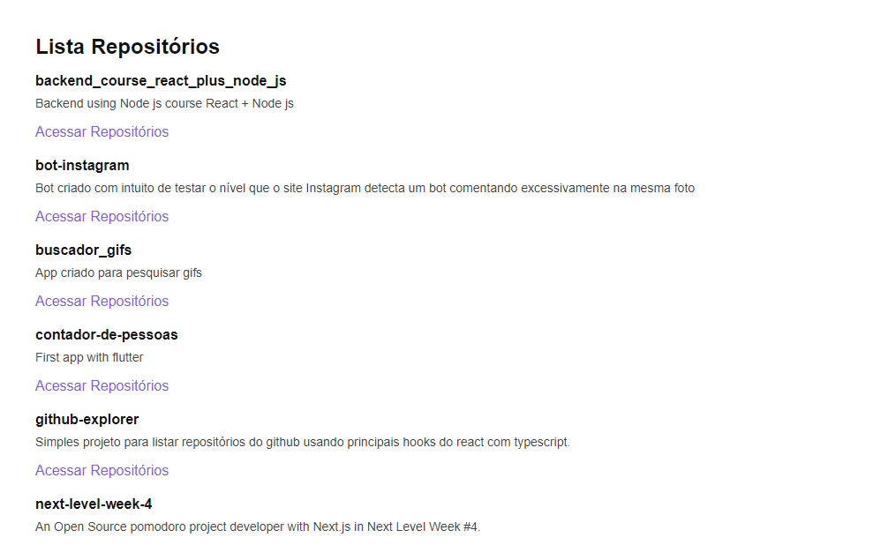

# github-explorer

Simples projeto para listar repositórios do github usando principais hooks do react com typescript consumindo a API do próprio Github.

Este projeto foi criado do zero com a estrutura base de uma aplicação React utilizando ferramentas como:

  - Webpack

  - Babel

  - Webpack Dev server

  - SASS

  - Source Maps

  - Fast Refresh 

Foram utilizados conceitos importantes do React como componentes, propriedades, estados e hooks além de aplicar o TypeScript no  projeto para adicionar tipagem estática à aplicação, tanto como consumo de API externa.

Projeto realizado durante a jornada Ignite da @rocketseat.
